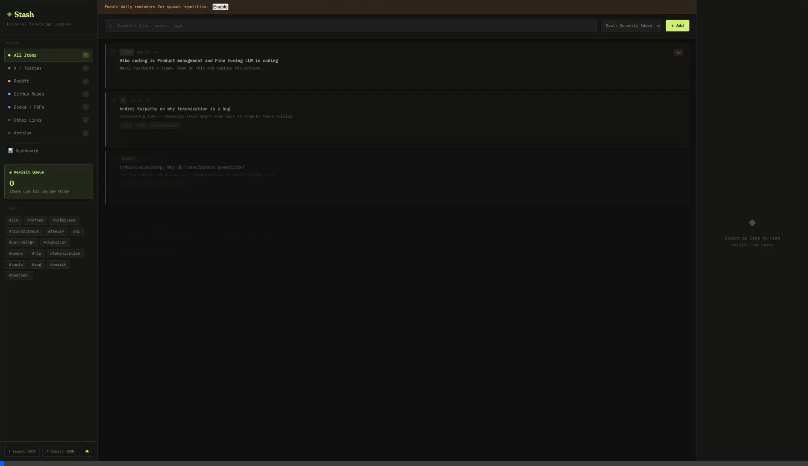
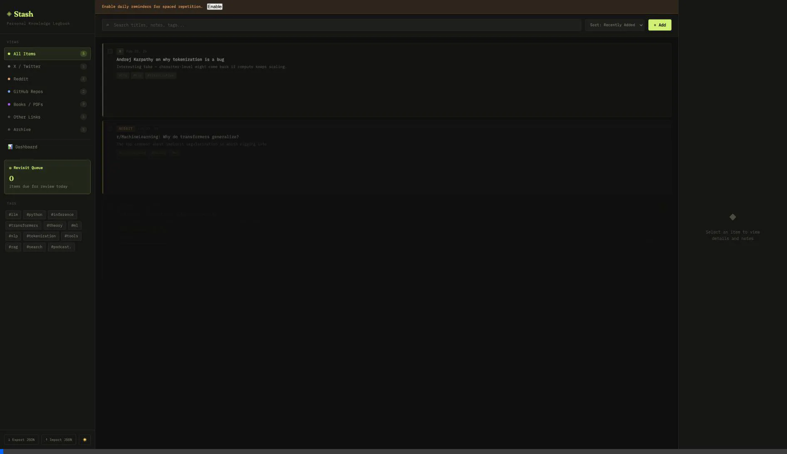

  
  <h1>Stash</h1>
  
<em>Your Personal Knowledge Logbook</em>

## Overview
Stash is a extremely polished, local-first web application designed to help you curate, understand, and retain knowledge from various sources around the web. Built with a beautiful interface, dark/light mode support, and focusing on high utility, Stash is perfect for keeping track of interesting links, tweets, books, and GitHub repositories without losing them in a sea of browser bookmarks.

---

## 🚀 Key Features

### 🧠 Spaced Repetition & Habit Tracking
Never forget what you learned. Set exact date schedules using the **Date Picker** to actively review items when they are due. 
- Receive **Browser Notifications** for due items.
- Dynamic **Revisit Highlighting** shows you exactly how far out your scheduled reviews are.

### ⚡ Power User Capabilities
- **Bulk Management**: Multi-select items via checkboxes. Export or Bulk Delete items using the sliding Action Bar.
- **Advanced Search**: Multi-word, full-text search across titles, notes, and tags. Refine with an interactive Tag Cloud and advanced Sort options.
- **Keyboard Navigation**: Use `Cmd+K` to quickly stash, `Esc` to close modals, and `Up/Down` arrow keys to seamlessly traverse your stash list!

### 🔒 100% Local & Secure Data Persistence
- **Offline PWA support**: Install Stash directly to your OS dock/homescreen. It works completely offline!
- **IndexedDB**: All data is saved instantly and asynchronously to `IndexedDB` with practically unlimited storage capacity.
- **Custom UI Dialogs**: No more fragile browser `alert()` pop-ups. Stash uses a robust, beautiful custom modal system for all deletions and JSON Import/Export flows.
- **Safety Reminders**: An auto-backup banner protects your data by nudging you to download your JSON backup if 7 days have passed.
- **Archive System**: Safely archive items instead of permanently deleting them. Easily restore them from the dedicated Archive tab.

### 🎨 Beautiful, Responsive Polish
- **Dark/Light Mode**: Instantly toggle themes that persist across sessions.
- **Mobile Responsive**: Adapts perfectly to mobile screens with touch-friendly targets and an elegant slide-up detail panel.
- **Zero Empty States**: Beautiful illustrative empty states guide you when your stash is clear.
- **Active Link Health**: Instantly verify if a URL is still active using the "Verify Link" CORS proxy tool.

---

## 📸 Workflows & Demonstrations

### 1. The Add & Edit Flow with Spaced Repetition
Quickly add items, automatically detect their types (GitHub, Reddit, X), edit their details, and schedule exact revisit dates.

### 2. Bulk Actions & Custom Dialogs
Select multiple items, view the Action Bar, and safely bulk delete items with the custom Stash Dialog interface.

### 3. Dashboard, Archiving, and Theme Toggling
Track your knowledge growth! View analytics in the Dashboard, safely archive notes, and freely toggle Dark/Light themes.

### 4. Fully Mobile Responsive
Use Stash flawlessly on narrow screens with our slide-up detail panel and bottom action bars.

---

## 🛠 Getting Started

Since Stash is a purely client-side HTML application with a Service Worker, you can run it instantly:

1. Clone or download this repository.
2. Open `stash.html` directly in your favorite modern browser (e.g., Chrome, Firefox, Safari, Arc).
3. Start stashing!

## 🌐 Deployment (GitHub Pages)

Because Stash is self-contained with no backend, hosting it online for your personal use is incredibly easy using **GitHub Pages**.

1. Fork or create a new public/private GitHub repository containing `stash.html`, `sw.js`, `manifest.json`, and the `assets/` folder.
2. Go to the repository **Settings > Pages**.
3. Under "Build and deployment", select **Deploy from a branch** and choose your `main` branch.
4. Access your live PWA Stash app at `https://<your-username>.github.io/<repository-name>/stash.html`.

*(Note: Because Stash uses IndexedDB, your data remains safely stored in the browser of the device you are using, even when accessed via a public GitHub Pages URL. Install it directly as an app from the browser URL bar!)*

## 🧱 Technologies Used

- **Vanilla HTML / CSS / JavaScript**: Zero external node dependencies. Extremely fast.
- **Service Worker / Web App Manifest**: Full Progressive Web App (PWA) installation features and offline caching.
- **IndexedDB via Promises**: Asynchronous, non-blocking data persistence.
- **CSS Variables**: Seamless Dark & Light themes.
